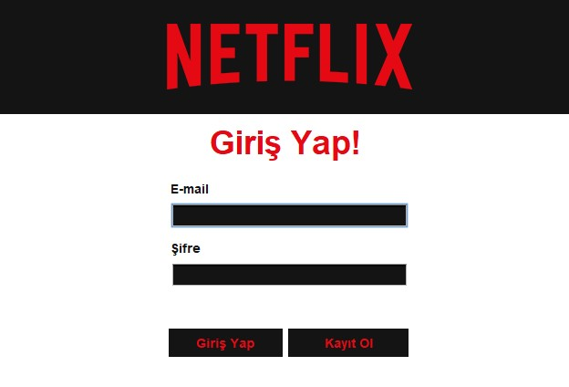
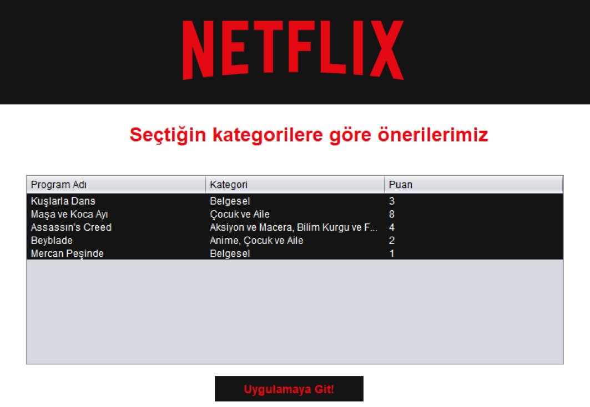

== Netflix Klon Uygulaması

*Amaç:* Masaüstü uygulaması geliştirirken veritabanı yönetim sistemlerinin yapısını anlaşılması ve çözüm sağlanabilmesi amaçlanmaktadır.Projenin içerikleri video olarak barındırması beklenmemektedir. Standart kullanıcı işlemlerinin veritabanı ile etkileşimi üzerine çalışma yapılmıştır.

Programlama dili olarak Java, arayüz olarak Swing GUI, veri tabanı yönetim sistemi olarak MySQL ve IDE olarak NetBeans kullanılmıştır.

=== Veritabanı Tasarımı

=== Uygulama içi görseller

*Giriş Sayfası*

Kullanıcı daha önceden hesap oluşturmuşsa ilgili alandaki bilgileri doldurup uygulamaya giriş yapabilir ya da "Kayıt Ol" butonuna basarak hesap oluşturma sayfasına geçebilir.

*Kayıt Sayfası*

Kullanıcı ilgili alanlardaki bilgileri doldurduktan ve sağ taraftaki kategori seçimlerini yaptıktan sonra "Kayıt Ol" butonuna basar ve karşısına seçtiği kategorilere göre önerilenler listesi çıkar.

*Öneri Sayfası*

Kullanıcının seçtiği kategoriler baz alınarak önerilenler listesi gösterilir. Puanlama diğer kullanıcıların yaptıkları değerlendirmelere göre değişir.

*İzleme Sayfası*

Kullanıcı arama çubuğu üzerinden dinamik arama yapabilir. İçerik izlemek için tablo üzerinden bir içeriğe tıklayıp izle butonuna basılması yeterlidir, durdurmak için izleme süresinin yanındaki durdur butonuna basılabilir ve devam etmek için tekrar izle butonuna basılmalıdır. Puan vermek için tablo üzerinden bir içeriğin üzerine tıklanıp puan ver butonun yanındaki alana istenen değer girilip butona basılmalıdır.

image::img/5.jpg[width=600px]

